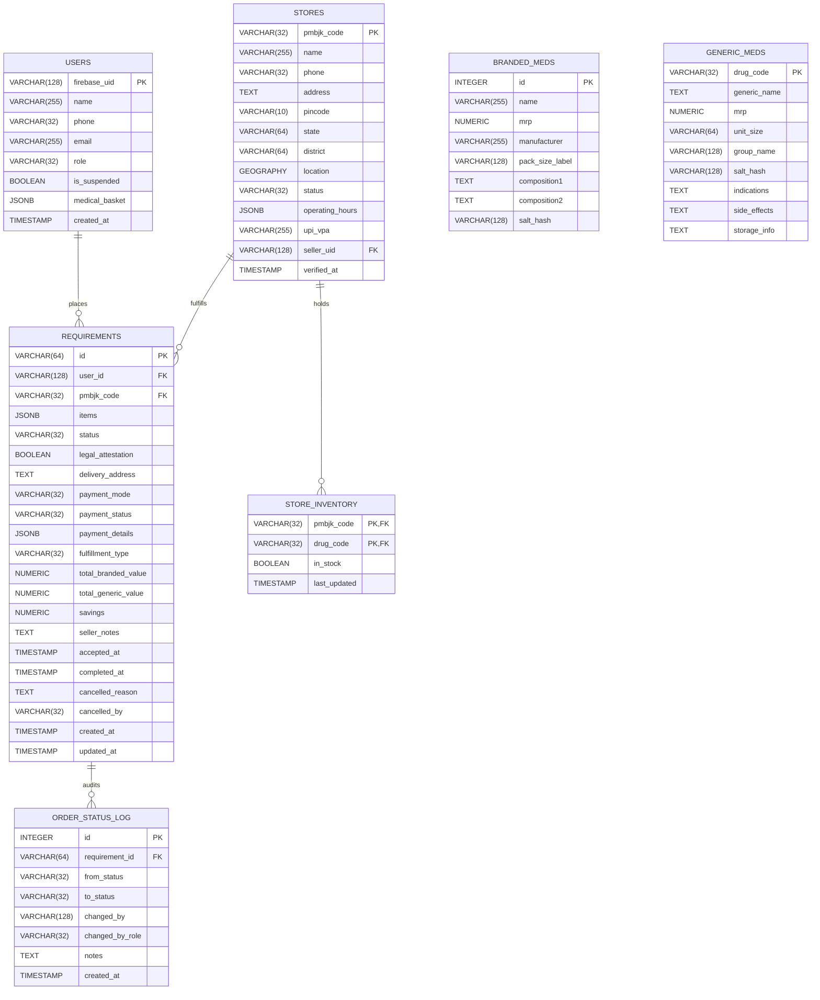
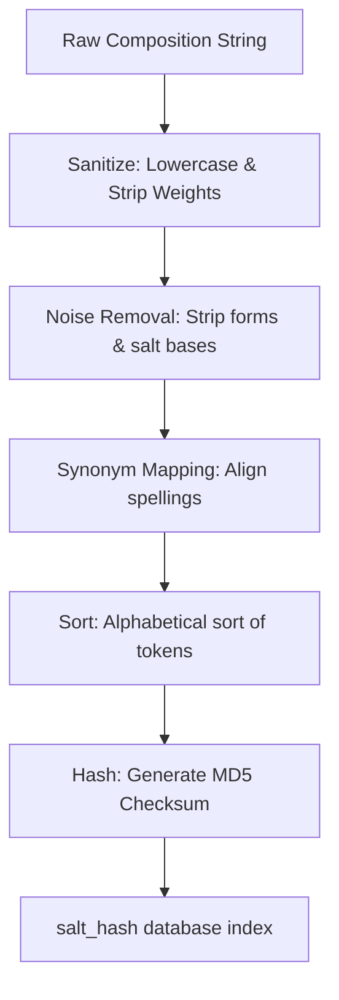
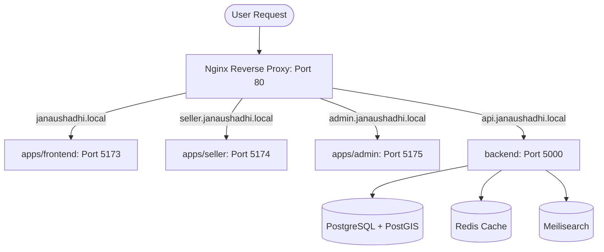
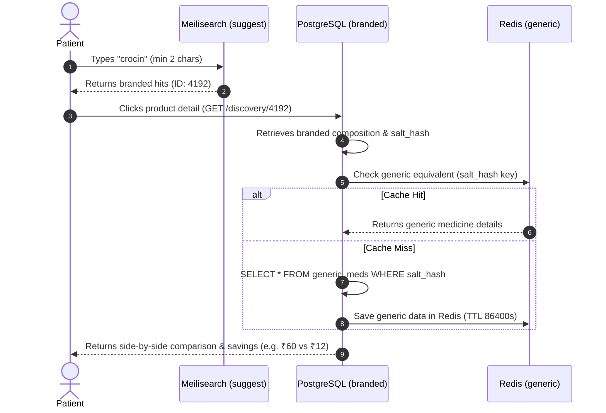
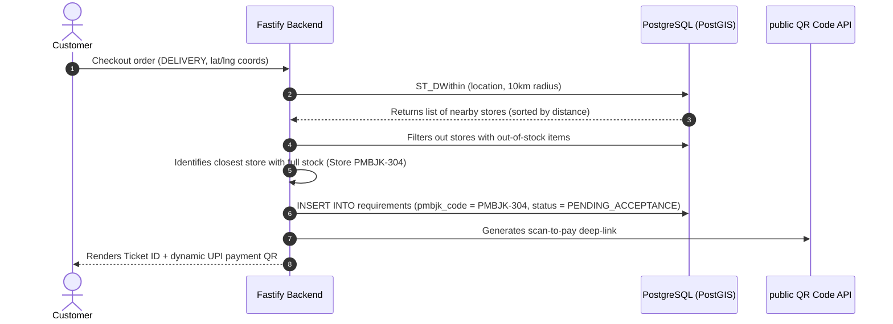

# Jan Aushadhi Platform: Comprehensive Technical Documentation & Architecture Deep-Dive

This document serves as the absolute, single-source-of-truth technical blueprint and reference manual for the **Jan Aushadhi** hyper-local generic drug discovery and commerce platform. It details every module, spatial database schema, background service, local loopback routing, caching configuration, dependency, and data workflow within the codebase.

---

## 1. System Topology & Monorepo Workspace Configuration

The Jan Aushadhi platform is engineered as a unified **npm Workspaces Monorepo** inside the root directory `c:\Users\Prathmesh Sarda\JAN-AUSHADHI`. It is split into four distinct, self-contained packages managed by a single root lockfile to prevent dependency drift:

### Workspaces Directory Blueprint

```
JAN-AUSHADHI/
├── package.json               # Root monorepo configuration & runner scripts
├── package-lock.json          # Unified lockfile for all packages
├── docker-compose.prod.yml    # Production container orchestration
├── nginx-proxy.conf           # Local loopback Nginx subdomain reverse proxy
├── .github/
│   └── workflows/
│       └── ci.yml             # Automated GitHub Actions validation pipeline
├── scratch/                   # Developer scripts & verification tools
├── scripts/                   # PDF & CSV data extraction scripts
├── backend/                   # [Package: janaushadhi-backend] Node/Fastify API
└── apps/
    ├── frontend/              # [Package: frontend] Consumer Discovery React App
    ├── seller/                # [Package: seller] Kendra Pharmacist React App
    └── admin/                 # [Package: admin] Operations Control React App
```

### Monorepo Dependency Orchestration (`package.json`)

The root `package.json` coordinates execution across all workspaces using standard npm workspaces flags, enabling isolated builds, linting, and typechecking from a single location:

```json
{
  "name": "janaushadhi-monorepo",
  "version": "1.0.0",
  "private": true,
  "workspaces": [
    "apps/frontend",
    "apps/seller",
    "apps/admin",
    "backend"
  ],
  "scripts": {
    "dev:backend": "npm run dev --workspace=janaushadhi-backend",
    "dev:frontend": "npm run dev --workspace=frontend",
    "dev:seller": "npm run dev --workspace=seller",
    "dev:admin": "npm run dev --workspace=admin",
    "build:backend": "npm run build --workspace=janaushadhi-backend",
    "build:frontend": "npm run build --workspace=frontend",
    "build:seller": "npm run build --workspace=seller",
    "build:admin": "npm run build --workspace=admin",
    "typecheck:backend": "npm run typecheck --workspace=janaushadhi-backend",
    "lint:frontend": "npm run lint --workspace=frontend",
    "lint:seller": "npm run lint --workspace=seller",
    "lint:admin": "npm run lint --workspace=admin"
  }
}
```

---

## 2. PostgreSQL + PostGIS Spatial Database Schema

The database utilizes **PostGIS** spatial extensions to map, calculate, and route orders to the closest physical store. The topology ensures high referential integrity and strict auditing of order fulfillment states.



### Database Optimization & Spatial Indices
1. **`stores.location`**: Declared as `GEOGRAPHY(POINT, 4326)`. Coordinates are computed along the curved ellipsoidal surface of the Earth (WGS 84). Spatial operations are accelerated using a high-performance Generalized Search Tree (GiST) index:
   ```sql
   CREATE INDEX idx_stores_location ON stores USING gist(location);
   ```
2. **`store_inventory`**: Composite Primary Key on `(pmbjk_code, drug_code)`. An additional single-column index is placed on `pmbjk_code` to accelerate quick cart stock verification:
   ```sql
   CREATE INDEX idx_inventory_store ON store_inventory(pmbjk_code);
   ```
3. **`branded_meds` & `generic_meds`**: Indexed on `salt_hash` to handle instantaneous molecule substitutions:
   ```sql
   CREATE INDEX idx_branded_salt ON branded_meds(salt_hash);
   CREATE INDEX idx_generic_salt ON generic_meds(salt_hash);
   ```

---

## 3. Backend Architecture & Service Modules (`/backend`)

The backend is built as a highly structured **Modular Monolith** using **Fastify 5** and **TypeScript**, maintaining strict boundary separation. It employs the **Application Factory Pattern** to isolate creation from the network lifecycle.

### Server Lifecycle & Application Factory (`src/app.ts`)
The server initialization decouples instance creation from network listening:
* **Testability Advantage**: Enables fast in-memory integration tests via Fastify's `server.inject()` without allocating local port binds, eliminating port conflicts in CI.
* **Global Error Handler**: Catches standard validations (AJV), custom `AppError` exceptions, and unhandled system failures. In production, unhandled traces are masked and logged internally to prevent security leaks.
* **Cross-Origin Resource Sharing (CORS)**: Configured dynamically via origin policies to support local subdomains securely.

### Global Dependencies Map
```
backend/src/
├── app.ts                  # Server creator & global middleware registration
├── index.ts                # App bootstrapper (port binder)
├── hooks/                  # Global preHandler hooks (e.g. Request Context)
├── shared/                 # Shared Infrastructure
│   ├── config.ts           # Unified Config Manager (Zod schema verified)
│   ├── constants.ts        # Common strings, Redises, TTLs
│   ├── errors.ts           # Unified AppError Hierarchy
│   ├── types.ts            # Absolute Type Definitions
│   └── infra/              # Firebase, pg, Redis, Meilisearch, Twilio adapters
└── modules/                # Domain Subsystems (Encapsulated Modules)
    ├── search/             # Meilisearch indices and suggest engines
    ├── catalog/            # Branded-to-generic mappings
    ├── stores/             # Kendra coordinates directories
    ├── fulfillment/        # Checkout and PostGIS routing
    ├── seller/             # Operator stock and order controls
    └── admin/              # Account provisioning and audits
```

---

## 4. Module Deep-Dives

### 4.1 Search & Salt-Hash Matcher (`/modules/search` & `/modules/catalog`)
The platform’s core differentiator is its deterministic branded-to-generic substitution engine. By resolving branded items to their underlying chemical salts, patients bypass name variances.

#### The Normalization Algorithm (`salt_hash`)
The chemical composition string undergoes standard sanitization, tokenization, sorting, and hashing:
1. **Sanitization**: Lowercases all letters, collapses whitespace, and strips standard weights/metrics (`500mg`, `10mcg`, `5ml`, `% w/v`, `iu`).
2. **Noise Removal**: Strips administrative words (*tablet, capsules, injection, vial, water for injection, suspension, syrup, drops, dispersible, hydrochloride, sodium, potassium, trihydrate, acid, base, hcl, extended release*).
3. **Synonym Mapping**: Aligns spelling variations (e.g., `amoxicillin` $\leftrightarrow$ `amoxycillin`, `clavulanate` $\leftrightarrow$ `clavulanic`, `paracetamol` $\leftrightarrow$ `acetaminophen`).
4. **Token Sorting**: Splitting elements, de-duplicating, sorting alphabetically, and joining with underscores `_`.
5. **Hash Generation**: Produces an MD5 hex checksum of the sorted tokens.
   * *Example*: Both `"Amoxycillin 500mg and Potassium Clavulanate 125mg Tablets IP"` and `"Amoxycillin (500mg) Clavulanic Acid (125mg)"` resolve to:
     `amoxycillin_clavulanic` $\rightarrow$ `5d25e0c6a8f10b7a8d8a7c6f05a102b4`.



#### Meilisearch Integration (`search.service.ts`)
Searches are indexed inside Meilisearch for high-speed autocomplete results. The search endpoint returns branded matches with extractable dosage forms, while suggestions bypass heavy SQL joins, loading in under **10ms**.

---

### 4.2 Fulfillment & Geolocation Routing Module (`/modules/fulfillment`)
Manages checkouts, legal attestations, dynamic UPI lookups, and PostGIS hyper-local delivery routing.

#### PostGIS Spatial Auto-Routing Engine
When a user selects "Home Delivery" during checkout, the routing engine identifies the closest active store within 10km containing all cart items in stock:
1. **Candidate Query**: Queries nearby stores using ellipsoidal boundary checks (`ST_DWithin` on `geography` casts) sorted by physical distance in meters:
   ```sql
   SELECT pmbjk_code, name, address, pincode, state, district,
          ST_Distance(location, ST_MakePoint($1, $2)::geography) AS distance
   FROM stores
   WHERE status = 'ACTIVE'
     AND ST_DWithin(location, ST_MakePoint($1, $2)::geography, 10000)
   ORDER BY distance ASC
   LIMIT 20;
   ```
2. **Stock Verification Filter**: Fetches all candidates from the database and cross-checks inventory:
   ```sql
   SELECT pmbjk_code
   FROM store_inventory
   WHERE pmbjk_code = ANY($1)
     AND drug_code = ANY($2)
     AND in_stock = false;
   ```
3. **Route Allocation**: The user is assigned to the nearest physical store that does *not* possess out-of-stock items for that order.

---

### 4.3 Seller Central Module (`/modules/seller`)
Coordinates operations for individual Kendra store operator dashboards, restricted under `requireRole('STORE_OWNER')`.

#### Scoped Order Listings
Operators only see orders scoped to their store code. The API enforces strict state transitions through the order lifecycle:
`PENDING_ACCEPTANCE` $\rightarrow$ `ACCEPTED` $\rightarrow$ `PREPARING` $\rightarrow$ `READY_FOR_PICKUP` $\rightarrow$ `COMPLETED`.

#### Composite Stock Toggle
Operators can toggle local stock states in real-time. The database handles this via transactional atomic UPSERT blocks:
```sql
INSERT INTO store_inventory (pmbjk_code, drug_code, in_stock, last_updated)
VALUES ($1, $2, $3, NOW())
ON CONFLICT (pmbjk_code, drug_code)
DO UPDATE SET in_stock = $3, last_updated = NOW();
```

---

### 4.4 Super Admin Module (`/modules/admin`)
Provides centralized platform oversight, restricted under `requireRole('SUPER_ADMIN')`.

#### Flipkart-Style Operator Provisioning
Rather than requiring operators to sign up manually, Super Admins provision them directly from the Admin Portal:
1. **Input**: Admins enter Operator Name, Phone, and Email.
2. **Firebase Account Creation**: Checks for accounts under the virtual email namespace `${pmbjk_code.toLowerCase()}@seller.janaushadhi.local`. If absent, a Firebase user is generated.
3. **Local Store Binding**: A transaction links the operator's Firebase `uid` into the `stores` table as `seller_uid`, sets the user role to `STORE_OWNER`, and marks the store verified.
4. **Cache Invalidation**: Invokes `invalidateRoleCache(userUid)` to purge Redis instantly, granting immediate dashboard access.

---

## 5. Shared Infrastructure & Middleware Adapter Layers

### 5.1 RBAC Cache Middleware (`/shared/infra/rbac.ts`)
To prevent database bottlenecks, the authentication middleware caches user role mappings inside Redis.

1. **Role Resolution Flow**:
   ```
   Request Auth -> Extract UID from Token -> Check Redis (user:role:uid)
                      |
                      +---> Cache Hit  --> Verify Role & Proceed
                      |
                      +---> Cache Miss --> Query PostgreSQL -> Set Redis (TTL 300s) -> Proceed
   ```
2. **Redis TTL Configuration**: Set to **300 seconds (5 minutes)**. Changes made by admins to roles are guaranteed to propagate globally within 5 minutes.
3. **Cache Purge Hook**: Role updates trigger a Redis cache invalidate event to ensure instant updates.

### 5.2 Unified Error Hierarchy (`/shared/errors.ts`)
Converts operational exceptions into structured HTTP JSON responses:
* `AppError`: Base exception class.
* `ValidationError` (400): Request schema or validation fails.
* `AuthenticationError` (401): Missing or expired Firebase Auth token.
* `AuthorizationError` (403): Insufficient permission, role mismatch, or suspended account.
* `NotFoundError` (404): Resource not found.
* `ConflictError` (409): Lifecycle transition rules violated.
* `ExternalServiceError` (503): Database connection loss or third-party service timeout.

---

## 6. Frontend Portal Applications (`/apps/`)

### 6.1 Client Discovery Portal (`/apps/frontend`)
* **Savings-First Cart**: Evaluates branded vs. generic pricing on the fly, showing users their total savings and savings percentage (e.g. *"Saving 84% on this order!"*).
* **HTML5 Coordinates Mapping**: Utilizes standard geolocation to fetch coords for auto-routing, falling back to a default location (e.g. Mumbai) if access is denied.
* **Dynamic UPI QR Component**: Employs an instant payment scan-to-pay component that formats UPI deep-links (`upi://pay?pa={vpa}&pn=PMBJK%20Kendra&am={amount}&cu=INR&tn={ticket_id}`) and renders them instantly via standard API endpoints without heavy external libraries.

### 6.2 Seller Central Partner Console (`/apps/seller`)
* **Credential Resolution**: Pharmacists enter their Store Code and password. The interface appends `@seller.janaushadhi.local` in the background before authenticating.
* **VPA Profile Configurator**: Allows operators to save their UPI ID, updating the PostgreSQL row immediately to receive dynamic scan payments.

### 6.3 Super Admin Console (`/apps/admin`)
* **Onboarding Interface**: Provisions new operators, toggles store status, and monitors platform-wide statistics.

---

## 7. Production DevOps Orchestration & Subdomain Routing

To manage subdomain isolation without separate servers, the monorepo utilizes an Nginx reverse proxy routing requests across a Docker bridged network.



### Subdomain Mapping Configuration (`nginx-proxy.conf`)
The routing maps the subdomains to their respective containers:
```nginx
server {
    listen 80;
    server_name janaushadhi.local;
    location / {
        proxy_pass http://frontend:80;
        proxy_set_header Host $host;
    }
}
server {
    listen 80;
    server_name seller.janaushadhi.local;
    location / {
        proxy_pass http://seller:80;
        proxy_set_header Host $host;
    }
}
server {
    listen 80;
    server_name admin.janaushadhi.local;
    location / {
        proxy_pass http://admin:80;
        proxy_set_header Host $host;
    }
}
server {
    listen 80;
    server_name api.janaushadhi.local;
    location / {
        proxy_pass http://backend:5000;
        proxy_set_header Host $host;
    }
}
```

### Production Multi-Stage Deployment (`docker-compose.prod.yml`)
The global composition coordinates production deployment:
* **Service Isolation**: The database, search engine, and caching layers are placed behind internal bridge networks.
* **Health Checks**: Containers wait to launch until Postgres and Redis are fully operational.

---

## 8. Verification & Performance Data

### Real-world Database Ingestion Metrics
* **Total Branded Medicines**: `253,973` commercial names indexed.
* **Generic Alternatives Available**: `170,671` medicines have matching low-cost generic replacements.
* **Overall substitution rate**: **67.2% coverage**, allowing more than two-thirds of searches to be converted to generic alternatives.

### Automated Validation CI/CD Pipeline (`.github/workflows/ci.yml`)
The workflow operates on all pull requests and pushes to the main branch:
1. **Linter Validation**: Verifies code consistency and syntax across all frontends.
2. **Type Check Pipeline**: Performs TypeScript compilation verification for the backend and frontends.
3. **Multi-Stage Build Validation**: Triggers compilation steps for the production container setups.

---

## 9. Core System Sequences

### 9.1 Client Discovery & Substitution Sequence


### 9.2 Spatial Order Routing & Payment Sequence

