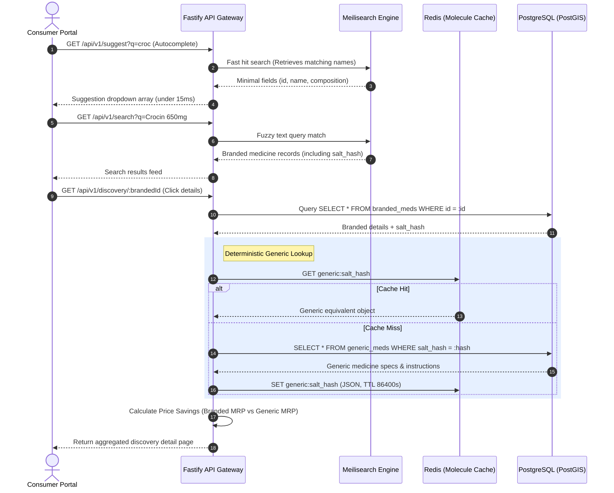
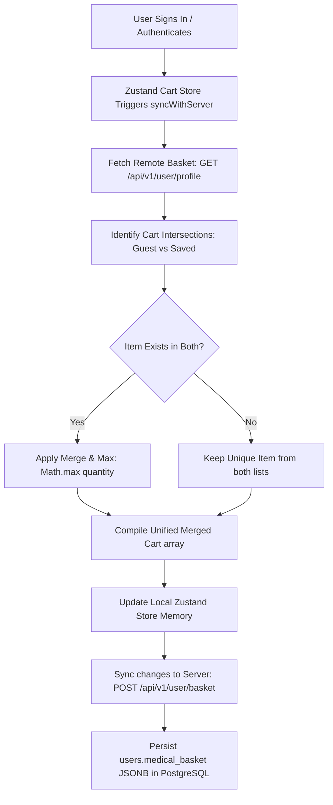
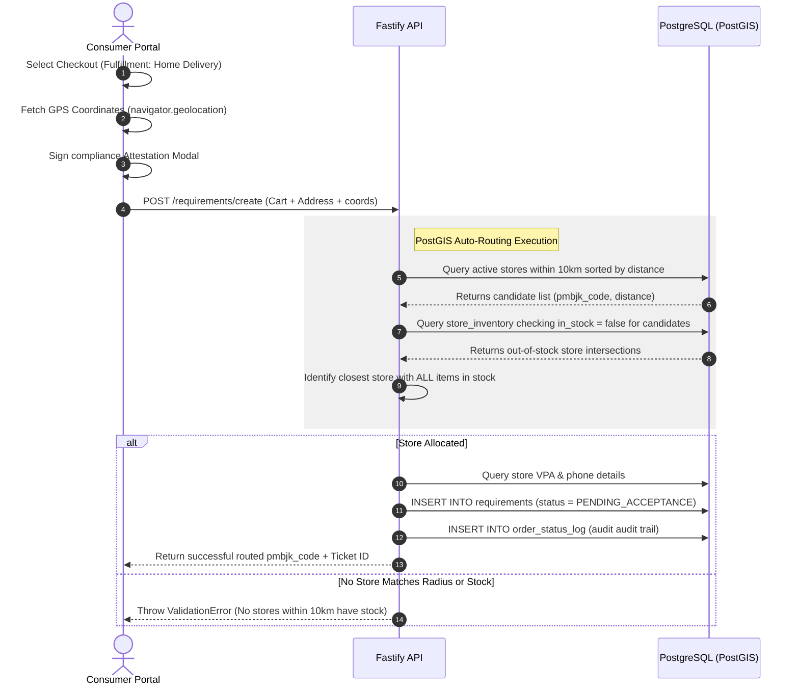
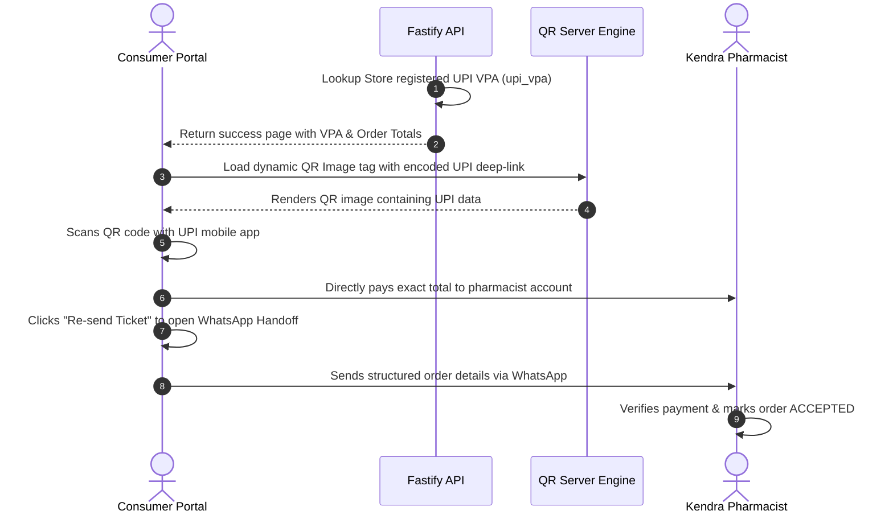
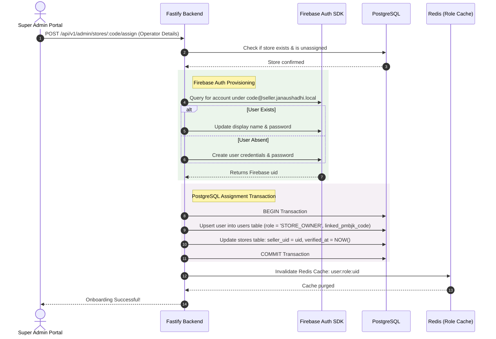
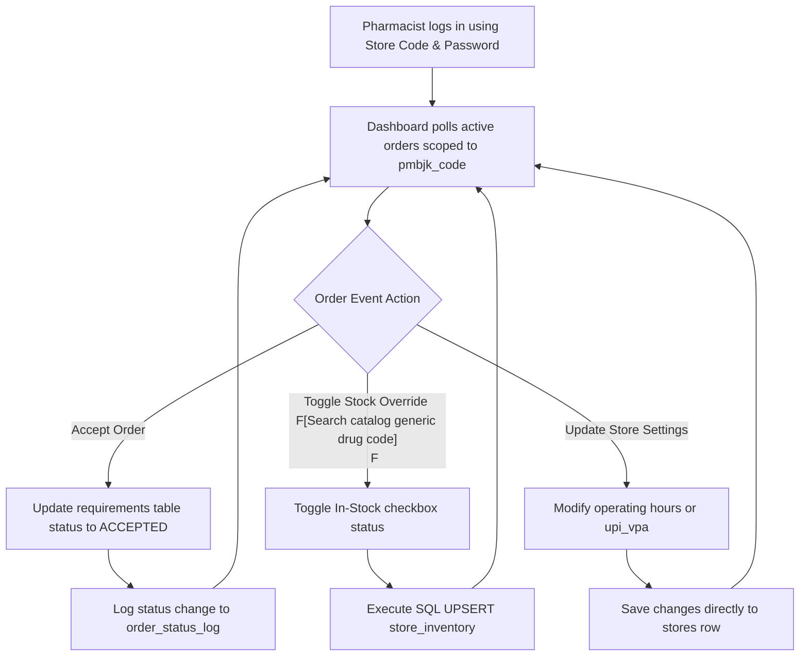

# Jan Aushadhi Platform: End-to-End System Workflows & Sequences

This document provides a highly detailed, step-by-step operational mapping of the primary business workflows and technical execution sequences implemented in the **Jan Aushadhi** hyper-local generic drug discovery and commerce platform. 

It details exactly how data flows across the monorepo packages—from the consumer frontend and pharmacist tools to the spatial database tables, caching systems, and authentication gateways.

---

## Workflow Directory Map

```
                      ┌──────────────────────┐
                      │ 1. Molecule Search   │
                      │  & Drug Discovery    │
                      └──────────┬───────────┘
                                 │
                      ┌──────────▼───────────┐
                      │ 2. Cart Sync Logic   │
                      │   (Merge & Max)      │
                      └──────────┬───────────┘
                                 │
                      ┌──────────▼───────────┐
                      │ 3. Checkout Gates    │
                      │  & Spatial Routing   │
                      └──────────┬───────────┘
                                 │
                      ┌──────────▼───────────┐
                      │ 4. UPI Payment QR    │
                      │   & P2P Settlement   │
                      └──────────┬───────────┘
                                 │
                      ┌──────────▼───────────┐
                      │ 5. Seller Onboarding │
                      │   & Dashboard Flow   │
                      └──────────────────────┘
```

---

## 1. Patient Molecule Search & Generic Drug Discovery

### Business Objective
Allow patients to search for expensive commercial brand-name medicines (e.g., Crocin, Augmentin) and instantly discover their chemical equivalent low-cost generic counterpart (PMBJP generic medicines) showing exact side-by-side pricing, composition metrics, and absolute cost savings.

### Technical Workflow Sequence



### Key Execution Steps
1. **Search Suggestion**: As the user types in the search bar, `SearchService.suggest` queries Meilisearch, returning lightweight autocomplete listings matching commercial formulations.
2. **Details Selection**: Clicking a branded medicine invokes `CatalogService.getDiscoveryDetail`.
3. **Molecules Check**: The database contains a normalized column called `salt_hash` on both `branded_meds` and `generic_meds`. This represents a unique MD5 hex checksum generated from a standardized tokenization of chemical components.
4. **Cache Check**: The system queries Redis using the prefix `generic:` combined with the product's `salt_hash`.
   * *If cached*: Returns the details immediately, avoiding a Postgres query.
   * *If missing*: PostgreSQL queries `generic_meds`, maps the results to standard types, and populates the Redis cache.
5. **Savings Calculation**: The engine computes pricing metrics:
   $$\text{Absolute Savings} = \text{Branded MRP} - \text{Generic MRP}$$
   $$\text{Savings Percentage} = \left(\frac{\text{Branded MRP} - \text{Generic MRP}}{\text{Branded MRP}}\right) \times 100$$
6. **Delivery**: The client receives a side-by-side comparison, highlighting the generic alternative and total percentage saved.

---

## 2. Shopping Cart Synchronization ("Merge & Max")

### Business Objective
A patient adds multiple generic medicines to their shopping cart as a guest user. Upon signing in or creating an account, their local guest cart must merge seamlessly with any pre-existing database cart without losing selections or duplicating quantities.

### Technical Workflow Sequence



### Rationale & Execution Flow
1. **Context Persistence**: Cart elements are managed on the client using a Zustand store (`useCartStore`) backed by `localStorage` persistence.
2. **Reconciliation Event**: Immediately after a user registers or logs in, the client invokes `syncWithServer()`.
3. **The "Merge & Max" Algorithm**: Summing quantities from separate guest and authenticated sessions (e.g. 3 packs added as guest, 1 pack already saved) could lead to unintended duplicate quantities during checkout. Overwriting the cart entirely would wipe the user's current session. The system loops through both sets and applies `Math.max` for overlapping items:
   ```javascript
   const merged = [...localItems];
   serverBasket.forEach(serverItem => {
     const localIndex = merged.findIndex(i => i.drug_code === serverItem.drug_code);
     if (localIndex > -1) {
       // Duplicate found: Keep the larger quantity
       merged[localIndex].quantity = Math.max(merged[localIndex].quantity, serverItem.quantity);
     } else {
       // Unique server item: Append to cart
       merged.push(serverItem);
     }
   });
   ```
4. **Postgres Sync**: The finalized reconciled cart is sent to the backend via `updateMedicalBasket(merged)`, saving the results as a `JSONB` array in the `users.medical_basket` field.

---

## 3. Geolocation-Aware Order Checkouts & PostGIS Spatial Auto-Routing

### Business Objective
Ensure delivery orders are routed only to active stores that have the entire cart in stock. The system leverages spatial geolocators and PostGIS query indices to direct orders to the closest store within 10km.

### Technical Workflow Sequence



### Key Execution Steps
1. **Fulfillment Selection**: During checkout, the user selects between "Self-Pickup" and "Home Delivery".
2. **Geolocation Handshake**: Selecting delivery triggers a call to `navigator.geolocation.getCurrentPosition` to fetch coordinates (`lat`/`lng`), falling back to a default location (e.g. Mumbai) if permissions are denied.
3. **Attestation Gate**: The user must check the "Attestation Checkbox", confirming they hold a valid physical prescription for all selected prescription medicines.
4. **PostGIS Radius Search**: The coordinates are sent to `FulfillmentService.createRequirement`. The backend runs an ellipsoidal distance query using geography casts to find active stores within a 10km radius:
   ```sql
   SELECT pmbjk_code, name, address, pincode, state, district,
          ST_Distance(location, ST_MakePoint($1, $2)::geography) AS distance
   FROM stores
   WHERE status = 'ACTIVE'
     AND ST_DWithin(location, ST_MakePoint($1, $2)::geography, 10000)
   ORDER BY distance ASC
   LIMIT 20
   ```
5. **Stock Constraint Check**: The backend fetches out-of-stock items for the candidate stores:
   ```sql
   SELECT pmbjk_code
   FROM store_inventory
   WHERE pmbjk_code = ANY($1)
     AND drug_code = ANY($2)
     AND in_stock = false
   ```
6. **Order Placement**: The nearest candidate store with all items in stock is assigned to the order. A ticket is created in `requirements` (e.g., `TKT-DAA04E`), an entry is added to `order_status_log`, and the results are returned to the client.

---

## 4. P2P Payment QR Generation & Direct Settlement

### Business Objective
Provide direct payment routing to store owners. By scanning a dynamic QR code on checkout, patients pay the Kendra owner directly via UPI without passing through intermediate transaction platforms.

### Technical Workflow Sequence



### Key Execution Steps
1. **VPA Registration**: Store owners configure their UPI virtual payment address (e.g. `pmbjk0012@sbi`) on their profile.
2. **Order Placement**: When an order is placed at a store with a registered VPA, the backend includes the `upi_vpa` in the checkout response.
3. **Deep-Link Assembly**: The consumer portal uses the order details to construct a standard UPI deep-link:
   `upi://pay?pa={vpa}&pn=PMBJK%20Kendra&am={amount}&cu=INR&tn={ticket_id}`
4. **Dynamic QR Generation**: Instead of pulling down heavy client-side JavaScript QR libraries, the application loads the QR image dynamically using a clean image asset tag:
   ```html
   
   ```
5. **WhatsApp Notification Handoff**: The user completes the payment transfer on their phone, then clicks "Send Ticket to Pharmacist" to open a pre-filled WhatsApp message.
6. **Acceptance**: The pharmacist reviews the WhatsApp message, verifies the payment, and updates the status in their portal.

---

## 5. Flipkart-Style Store Operator Provisioning

### Business Objective
Super Admins provision and link store operators directly from the operations dashboard, setting up authentication credentials without requiring manual registration by operators.

### Technical Workflow Sequence



### Key Execution Steps
1. **Operator Details**: An administrator enters the operator's Name, Phone, and Password in the Admin Portal.
2. **Account Check**: The backend checks for accounts under the virtual email namespace `${pmbjk_code.toLowerCase()}@seller.janaushadhi.local` using the Firebase Admin SDK.
3. **Firebase User Creation**:
   * *If the user exists*: Firebase updates their password and details.
   * *If the user does not exist*: Firebase creates a new account.
4. **Postgres Binding**: A SQL transaction upserts the user in PostgreSQL as a `STORE_OWNER` linked to the store, and updates the store's `seller_uid` and `verified_at` timestamp.
5. **Cache Purge**: The Redis role cache is cleared. The next time the operator accesses their dashboard, the system fetches their permissions from the database.

---

## 6. Seller Central Order Lifecycle & Inventory Overrides

### Business Objective
Enable pharmacists to process orders, update stock levels, and override store hours or UPI configurations.

### Technical Workflow Sequence



### Key Execution Steps
1. **Authentication**: The pharmacist logs in using their Store Code and password. The client appends `@seller.janaushadhi.local` in the background for Firebase authentication.
2. **Scoped Operations**: The dashboard pulls orders associated with their store code, restricting the view to relevant items.
3. **Status Log Auditing**: Every status change (e.g. accepting an order or marking it ready) is recorded in `order_status_log` to maintain an audit trail.
4. **Stock toggle**: Pharmacists search for medicines in the generic directory and toggle the stock status. The backend executes an atomic `ON CONFLICT DO UPDATE` statement in the `store_inventory` table.
5. **Profile adjustments**: Modifying operating hours or UPI addresses updates the stores table, immediately altering delivery routing eligibility and checkout payments.

---

## 7. Automated Continuous Integration Workflow

### Business Objective
Validate compilation integrity, type safety, linting conventions, and build configurations on every push and pull request.

### Continuous Integration Pipeline (`.github/workflows/ci.yml`)

```yaml
name: Production Integrity Pipeline

on:
  push:
    branches: [ master, main ]
  pull_request:
    branches: [ master, main ]

jobs:
  validate-workspace:
    runs-on: ubuntu-latest

    strategy:
      matrix:
        node-version: [20.x]

    steps:
    # 1. Fetch source code from Git
    - name: Checkout Codebase
      uses: actions/checkout@v4

    # 2. Set up Node workspace caching
    - name: Use Node.js ${{ matrix.node-version }}
      uses: actions/setup-node@v4
      with:
        node-version: ${{ matrix.matrix.node-version }}
        cache: 'npm'

    # 3. Clean workspace install of lockfile dependencies
    - name: Install Monorepo Dependencies
      run: npm ci

    # 4. Validate syntax rules on React clients
    - name: Lint Frontend Portals
      run: |
        npm run lint:frontend
        npm run lint:seller
        npm run lint:admin

    # 5. Verify type check boundaries
    - name: Typecheck Backend Server
      run: npm run typecheck:backend

    # 6. Verify multi-stage container assets compile
    - name: Validate Container Builds
      run: |
        docker build -t test-backend ./backend
        docker build -t test-frontend ./apps/frontend
        docker build -t test-seller ./apps/seller
        docker build -t test-admin ./apps/admin
```
